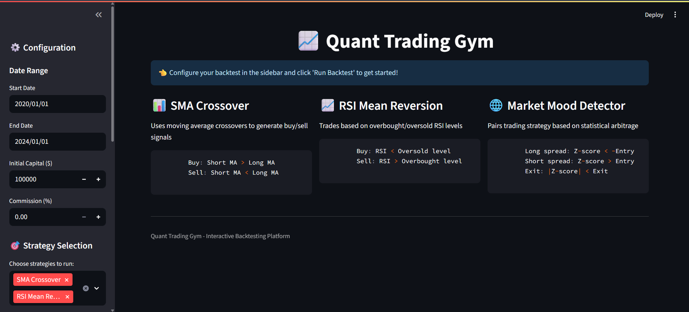

Here’s a cleaned-up, polished version of your README with consistency fixes, formatting improvements, and typo corrections:

---

# 📈 Quant Trading Gym

> **A Robotic Playground for Algorithmic Trading Strategies** 🤖➡️📊➡️💰

[](https://python.org)
[](https://streamlit.io)
[](LICENSE)

**🏆 Hackathon-ready project for quantitative finance strategy development and testing**



---

## ✨ Features

* **Three Trading Robots**

  * **SMA Crossover Robot:** Buys when fast SMA crosses above slow SMA
  * **RSI Mean Reversion Robot:** Buys when oversold, sells when overbought
  * **Market Mood Robot:** Pairs trading using z-score between two assets

* **Professional Tools**

  * Interactive web dashboard (Streamlit)
  * Real-time performance metrics (Sharpe Ratio, Drawdown, Returns)
  * Customizable parameters for each strategy
  * Multi-asset support (Stocks, ETFs, Crypto)
  * Clear visualizations and comparison charts

---

## 🚀 Quick Start

### Installation

```bash
# Clone the repository
git clone https://github.com/uniquepratham/quant-trading-gym.git
cd quant-trading-gym

# Install dependencies
pip install -r requirements.txt
```

### Run the Web App

```bash
streamlit run app.py
```

Open [http://localhost:8501](http://localhost:8501) in your browser.

### Run Command Line Version

```bash
python main.py
```

---

## 📊 Example Strategy Performance

| Strategy           | Total Return | Sharpe Ratio | Max Drawdown |
| ------------------ | ------------ | ------------ | ------------ |
| SMA Crossover      | -17.4%       | -0.85        | -19.8%       |
| RSI Mean Reversion | +5.3%        | +0.89        | -1.6%        |
| Market Mood        | Customizable | Customizable | Customizable |

---

## 🎮 How to Use

1. **Open the Web App:**
   `streamlit run app.py`

2. **Choose Your Robots:**
   Select strategies to test

3. **Set the Rules:**
   Adjust parameters such as:

   * SMA periods (e.g., 20 vs 50 days)
   * RSI thresholds (e.g., 30 oversold, 70 overbought)
   * Z-score entry/exit levels (e.g., 2.0 entry, 0.5 exit)

4. **Pick Your Assets:**
   Backtest on QQQ, SPY, BTC-USD, etc.

5. **Launch Backtest:**
   Watch your robots trade.

6. **Analyze Results:**
   Compare performance metrics and identify the best strategy.

---

## 🏗️ Project Structure

```
quant-trading-gym/
├── app.py                 # 🎪 Streamlit dashboard
├── main.py                # ⚡ CLI testing version
├── backtester.py          # 🤖 Trading simulation engine
├── utils.py               # 📦 Data handling & utilities
├── strategies/            # 🎯 Trading robots
│   ├── sma_crossover.py   # 📊 SMA crossover strategy
│   ├── rsi_meanrev.py     # 📈 RSI mean reversion
│   └── market_mood.py     # 🌐 Pairs trading strategy
├── outputs/               # 📸 Charts & results
└── requirements.txt       # 📋 Dependencies
```

---

## 🏆 Hackathon Achievements

| Requirement               | Status                 |
| ------------------------- | ---------------------- |
| Quantitative Strategies   | ✅ 3+ Implemented       |
| Backtesting Framework     | ✅ Metrics & engine     |
| Multiple Timeframes       | ✅ Daily + customizable |
| Transaction Cost Modeling | ✅ Commission parameter |
| Risk Management           | ✅ Position sizing      |
| Performance Metrics       | ✅ Sharpe, Drawdown     |
| Parameter Optimization    | ✅ Interactive tuning   |
| Python Implementation     | ✅ Complete             |
| Documentation             | ✅ README + comments    |

---

## 🧠 Technical Details

* **Data Source:** Yahoo Finance API (real market data)
* **Assets:** Stocks (QQQ, SPY), Crypto (BTC-USD)
* **Algorithms:** SMA Crossover, RSI Mean Reversion, Z-Score Pairs Trading
* **Metrics:** Total Return, Annualized Return, Sharpe Ratio, Volatility, Max Drawdown, Calmar Ratio

---

## 🔮 Future Enhancements

* Live trading integration (Alpaca API, Binance API)
* Machine learning strategies (LSTM, Reinforcement Learning)
* Advanced risk management (Stop-loss, position sizing)
* Multi-asset portfolio optimization
* Real-time WebSocket market data

---

## 📜 License

This project is licensed under the MIT License. See the [LICENSE](LICENSE) file for details.

---

## 🙋 Need Help?

Open an issue or reach out at **[your.email@example.com](mailto:your.email@example.com)**

⭐ **Star this repo if you found it useful for your hackathon!**

> *“The only way to win at trading is to have a better strategy — and this helps you find it.”*

---